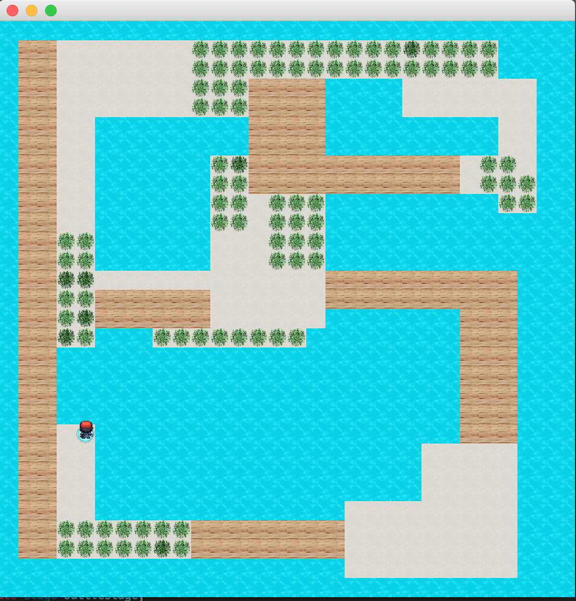
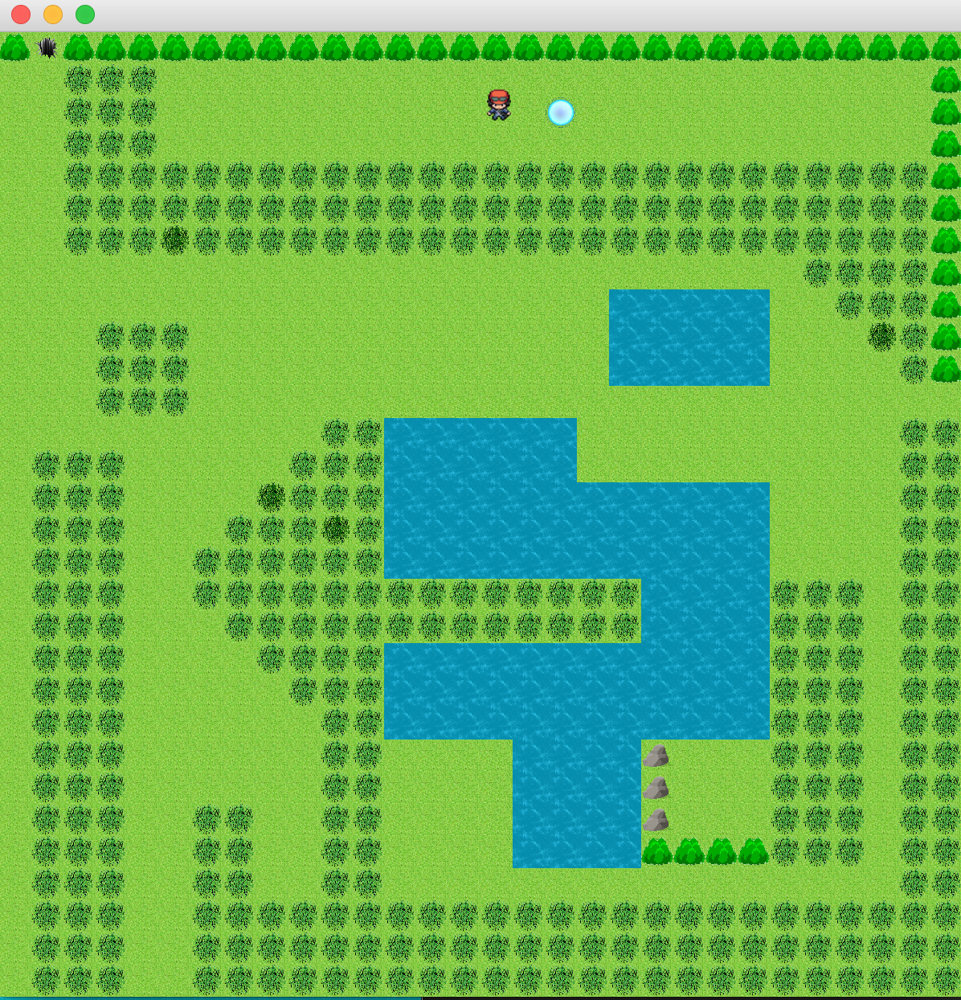
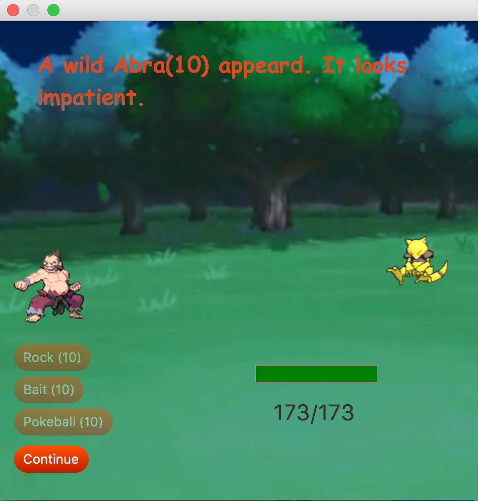

# pokemon-catchers
Adaption of the popular pokemon safari and multiplayer battles. 
In single player mode, the player can access 6 different maps
to explore and catch different pokemon. The pokemon you catch are saved to your current game and can be used to battle other players in multiplayer mode.

 # Safari starting conditions
 Each player get 500 steps and starts with
 * 10 pokeballs
 * 10 rocks
 * 10 baits
# Instructions
  * Use the Arrow keys control directions
  * 'P' Open the current Pokedex
  * 'I' Show current inventory
  * 'S' Get current step count for player
  * Items are hidden among grass or in dark places.
  
# Screenshots

